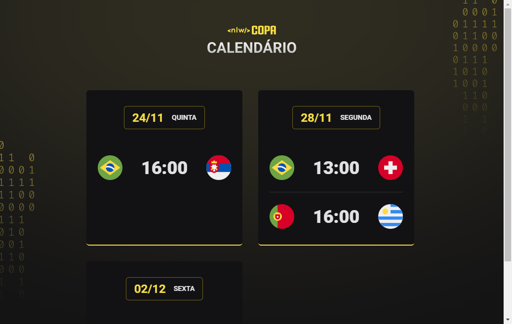

# Calendário da Copa 2022
Projeto criado na NLW Copa 2022 - Trilha Explorer da Rocketseat.  
O objetivo era criar um calendário dos jogos da Copa 2022 e explorar os aprendizados e conhecimentos sobre HTML, CSS e JavaScript.

## Tecnologias 🚀
- HTML
- CSS
- JavaScript

[Clique aqui](https://gustavoaamorim.github.io/NLW-explorer-COPA22/) para acessar a página do projeto.
